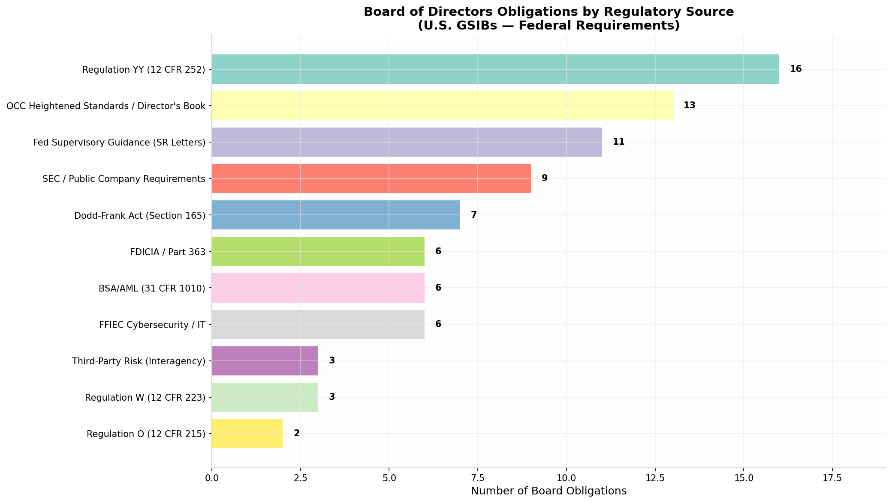
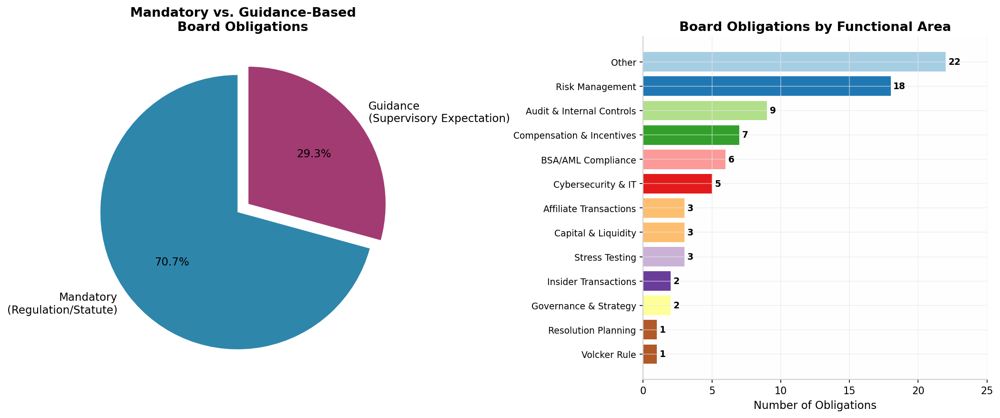
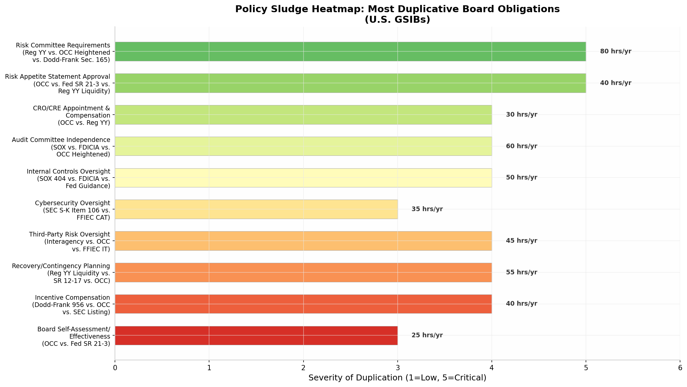

# Policy Sludge and the Boardroom: A Comprehensive Inventory of Federal Obligations of U.S. GSIB Boards of Directors

**Date:** June 5, 2026  
**Scope:** All federally imposed obligations on boards of directors of U.S. Globally Systemically Important Banks (GSIBs)  
**Purpose:** Identify duplicative, overlapping, and unduly burdensome requirements that constitute "policy sludge"

---

## TL;DR

U.S. GSIB boards face **82 distinct federal-level obligations** spanning **11 regulatory sources**, from **Regulation YY's 16 mandatory requirements** to **OCC Heightened Standards**, **Dodd-Frank Section 165**, **SEC rules**, **FDICIA**, and **interagency guidance**. Nearly **71% of these obligations are mandatory** (statute or regulation), not merely supervisory guidance. The most concentrated "sludge" appears in **risk committee requirements** (three overlapping sources), **risk appetite statement approvals** (three sources), **audit committee independence standards** (three sources), and **internal controls oversight** (three sources). Conservative estimates suggest these duplicative obligations consume **460+ board hours annually** that could be redirected to substantive risk oversight.

---

## 1. Introduction: The Anatomy of Policy Sludge

The concept of "policy sludge" — the accumulation of duplicative, overlapping, and unduly burdensome regulatory requirements over time — has gained traction among banking regulators and industry participants alike. For boards of directors at the eight U.S. Globally Systemically Important Banks (GSIBs), this sludge is not an abstract policy concern; it is a practical, weekly reality that manifests in redundant committee meetings, overlapping approval processes, and repetitive documentation requirements that consume director time without proportionally improving safety and soundness.

The eight U.S. GSIBs — **JPMorgan Chase, Bank of America, Citigroup, Wells Fargo, Goldman Sachs, Morgan Stanley, State Street, and Bank of New York Mellon**  [(Federal Reserve Board)](https://www.federalreserve.gov/supervisionreg/global-systemically-important-banks.htm)  — collectively hold approximately **$14 trillion in assets** and operate under the most intensive supervisory regime in U.S. banking history. Their boards are simultaneously the primary governance body for a publicly traded corporation (subject to SEC rules), the oversight body for a federally supervised bank holding company (subject to Federal Reserve rules), and the steward of one or more nationally chartered banks (subject to OCC rules). This tripartite regulatory exposure, layered with Dodd-Frank enhanced prudential standards, interagency guidance, and FFIEC expectations, creates a thicket of obligations that no single director can reasonably hold in working memory.

The Federal Reserve itself has acknowledged this problem, at least implicitly. In February 2021, it issued **SR 21-3**, "Supervisory Guidance on Board of Directors' Effectiveness," which simultaneously consolidated 27 prior supervisory letters and attempted to "scale back [board] involvement in the day-to-day operations of their institutions."  [(Federal Reserve Board)](https://www.federalreserve.gov/supervisionreg/srletters/SR2103.htm)  Yet even this consolidation effort left the core architecture of overlapping requirements intact. The OCC followed with its own **Director's Book** revisions and **Heightened Standards** (12 CFR Part 30, Appendix D), while the SEC added cybersecurity disclosure rules under **Regulation S-K Item 106**. Each rulemaking was defensible in isolation; together, they constitute a cumulative burden that may be undermining the very governance effectiveness regulators seek to promote.

This inventory identifies **82 distinct board-level obligations** imposed by federal statute, regulation, or formal supervisory guidance on U.S. GSIB boards. Each obligation is mapped to its legal citation, classified as mandatory or guidance-based, and analyzed for overlap with other requirements. The final section identifies the ten most significant "sludge zones" and offers concrete recommendations for streamlining.

---

## 2. The Regulatory Architecture: Why GSIBs Face Extraordinary Board Burdens

Understanding policy sludge requires understanding the regulatory architecture that produces it. U.S. GSIBs operate at the intersection of at least five distinct federal regulatory frameworks, each with its own theory of board responsibility.

### 2.1 The Federal Reserve Framework: Consolidated Supervisor

As the consolidated supervisor of bank holding companies, the Federal Reserve imposes board obligations through three primary channels: **statutes** (the Bank Holding Company Act, the Federal Reserve Act, the Dodd-Frank Act), **regulations** (Regulation YY, Regulation W, Regulation O), and **supervisory guidance** (SR letters). The Fed's approach has evolved significantly since the 2008 crisis. **SR 12-17** (2012) established the consolidated supervision framework for large financial institutions, articulating expectations for corporate governance, capital and liquidity planning, recovery planning, and resolution planning.  [(Federal Reserve Board)](https://www.federalreserve.gov/supervisionreg/srletters/sr1217.htm)  **SR 21-3** (2021) consolidated decades of board-specific guidance into five "key attributes" of effective boards.  [(Federal Reserve Board)](https://www.federalreserve.gov/supervisionreg/srletters/SR2103.htm)  The result is a dense web of expectations that Reserve Bank examiners assess through the **Large Financial Institution (LFI) rating system**, where board effectiveness is an explicit component of the Governance and Controls rating.  [(Federal Reserve Board)](https://www.federalreserve.gov/supervisionreg/topics/large-banking-organization-supervision.htm) 

The statutory foundation for the Fed's most prescriptive board requirements is **Dodd-Frank Section 165** (12 U.S.C. 5365), which mandates enhanced prudential standards for bank holding companies with $50 billion or more in total consolidated assets.  [(Federal Reserve Board)](https://www.federalreserve.gov/publications/2018-january-report-to-congress-on-implementation-of-enhanced-prudential-standards.htm)  Section 165(h) requires risk committees, Section 165(i) requires stress testing, Section 165(d) requires resolution plans (living wills), and Section 165(e) authorizes single-counterparty credit limits. The Fed implemented these requirements through **Regulation YY (12 CFR Part 252)**, which for GSIBs (Category I institutions) imposes the most stringent requirements.  [(eCFR)](https://www.ecfr.gov/current/title-12/chapter-II/subchapter-A/part-252)  Subpart D of Regulation YY alone contains 16 distinct board-level obligations, from risk committee composition requirements to liquidity risk tolerance approvals to contingency funding plan reviews.  [(GovInfo)](https://www.govinfo.gov/link/cfr/12/252?link-type=pdf&year=mostrecent) 

### 2.2 The OCC Framework: Charter Supervisor

For GSIBs with national bank subsidiaries — which includes all eight U.S. GSIBs — the OCC imposes an additional, and in many respects parallel, set of board obligations. The OCC's **Heightened Standards** (formally, "Guidelines Establishing Heightened Standards for Certain Large Insured National Banks," codified at 12 CFR Part 30, Appendix D) apply to any national bank with average total consolidated assets of $50 billion or more.  [(Office of the Comptroller of the Currency (OCC))](https://www.occ.gov/news-issuances/news-releases/2014/nr-occ-2014-117.html)  These guidelines require boards to approve a formal risk governance framework, approve risk appetite statements, approve the appointment and compensation of the Chief Risk Executive, and ensure the independence of internal audit. The OCC also maintains the **Director's Book**, a comprehensive supervisory resource that articulates expectations for board composition, responsibilities, and oversight practices.  [(Office of the Comptroller of the Currency (OCC))](https://www.occ.gov/publications-and-resources/publications/banker-education/files/pub-directors-book.pdf) 

The critical feature of the OCC framework, from a sludge perspective, is that it applies at the **bank level** rather than the **holding company level**. A GSIB board member who serves on both the BHC board and the lead national bank board may find themselves approving substantively similar risk governance frameworks, risk appetite statements, and CRO compensation packages under two different regulatory regimes — Fed rules at the holding company level and OCC guidelines at the bank level. The agencies have attempted to mitigate this through **holding company exception** provisions, but the structural duplication remains.

### 2.3 The SEC Framework: Public Company Governance

As publicly traded companies listed on national securities exchanges, all U.S. GSIBs are subject to SEC governance requirements that operate independently of bank-specific regulation. **Sarbanes-Oxley Section 301** mandates audit committee independence and authority. **Sarbanes-Oxley Section 404(a)** requires management's annual assessment of internal control over financial reporting (ICFR), while **Section 404(b)** requires external auditor attestation.  [(Donnelley Financial Solutions)](https://www.dfinsolutions.com/knowledge-hub/blog/what-is-sox-404)  **SEC Regulation S-K Item 407** requires disclosure of audit committee financial experts and compensation committee independence.  [(SEC.gov)](https://www.sec.gov/about/offices/oia/oia_rulemaking/accommodations.htm)  **NYSE and Nasdaq listing standards** impose additional requirements for independent directors, nominating committees, and related-party transaction oversight.

The SEC's **cybersecurity disclosure rules** (Regulation S-K Item 106), adopted in 2023, added a new layer of board-level obligation by requiring public companies to disclose their cybersecurity risk management, strategy, and governance — including the board's role in overseeing cybersecurity risks.  [(Step Internal Audit Checklist)](https://optro.ai/blog/sox-404)  This requirement intersects directly with FFIEC cybersecurity guidance and the agencies' safety-and-soundness expectations, creating yet another area of overlapping board responsibility.

### 2.4 The Interagency Framework: Cross-Cutting Expectations

Several board obligations arise from interagency guidance that applies across all banking regulators. The **FFIEC Cybersecurity Assessment Tool**, while technically voluntary, establishes supervisory expectations for board oversight of cybersecurity programs that all three prudential regulators incorporate into their examination protocols.  [(Mass.gov)](https://www.mass.gov/files/2017-06/FFIEC_CAT_CEO_Board_Overview_June_2015_PDF1.pdf)  The **2023 Interagency Guidance on Third-Party Relationships** explicitly assigns board-level responsibility for overseeing third-party risk management.  [(Independent Community Bankers of America)](https://www.icba.org/w/interagency-guidance-for-bank-risk-management-of-third-party-relationships)  The **FFIEC BSA/AML Examination Manual** designates the board as having "primary responsibility" for ensuring an effective BSA/AML compliance program.  [(Troutman Pepper)](https://www.troutman.com/insights/board-member-responsibilities-for-bsaaml-compliance/)  These interagency expectations add breadth to board responsibilities while also creating overlap with agency-specific requirements.

---

## 3. The Complete Inventory: 82 Federal Board Obligations

The following inventory catalogs all identified federal-level obligations of U.S. GSIB boards of directors. Obligations are organized by regulatory source and classified as either **Mandatory** (arising from statute or regulation), **Mandatory (OCC)** (arising from OCC enforceable guidelines), or **Guidance** (arising from supervisory guidance that does not have the force of law but informs examination ratings).

### 3.1 Regulation YY — Enhanced Prudential Standards (12 CFR Part 252)

Regulation YY implements the enhanced prudential standards required by Dodd-Frank Section 165. For Category I institutions (U.S. GSIBs), Subparts D, E, F, G, and H impose the following board-level obligations:

| # | Obligation | Citation | Type |
|---|-----------|----------|------|
| 1 | Maintain independent risk committee that approves and periodically reviews risk-management policies of global operations | 12 CFR 252.33(a)(1) | Mandatory |
| 2 | Risk committee must have formal, written charter approved by the board | 12 CFR 252.33(a)(3)(i) | Mandatory |
| 3 | Risk committee must be independent board committee with sole responsibility for risk-management policies | 12 CFR 252.33(a)(3)(ii) | Mandatory |
| 4 | Risk committee must report directly to the board of directors | 12 CFR 252.33(a)(3)(iii) | Mandatory |
| 5 | Risk committee must receive and review regular CRO reports on not less than quarterly basis | 12 CFR 252.33(a)(3)(iv) | Mandatory |
| 6 | Risk committee must meet at least quarterly, document proceedings | 12 CFR 252.33(a)(3)(v) | Mandatory |
| 7 | Risk committee must be chaired by independent director meeting SEC/NYSE independence standards | 12 CFR 252.33(a)(4)(ii) | Mandatory |
| 8 | Board must appoint CRO with experience in risk management of large, complex firms | 12 CFR 252.33(b)(1) | Mandatory |
| 9 | Board of directors must approve the firm's liquidity risk tolerance | 12 CFR 252.34(a)(1) | Mandatory |
| 10 | Board must approve and periodically review liquidity risk-management strategies, policies, and procedures | 12 CFR 252.34(a)(2) | Mandatory |
| 11 | Risk committee (or designated subcommittee) must approve contingency funding plan at least annually | 12 CFR 252.34(b) | Mandatory |
| 12 | Board must oversee company-run stress testing processes and results | 12 CFR 252.54 | Mandatory |
| 13 | Board must ensure firm submits required data for Federal Reserve supervisory stress tests | 12 CFR 252.44 | Mandatory |
| 14 | Board must ensure compliance with external long-term debt and TLAC requirements | 12 CFR 252.62–252.63 | Mandatory |
| 15 | Board must oversee compliance with restrictions on corporate practices of U.S. GSIBs | 12 CFR 252.64 | Mandatory |
| 16 | Board must ensure compliance with credit exposure limits to single counterparties | 12 CFR 252.70–252.78 | Mandatory |

Regulation YY alone imposes **16 mandatory board obligations**, more than any other single regulatory source. Several of these obligations merit particular attention for sludge analysis. The risk committee requirements (items 1–7) substantially duplicate OCC Heightened Standards and Dodd-Frank Section 165(h) statutory requirements. The liquidity risk tolerance approval (item 9) and contingency funding plan approval (item 11) overlap with SR 12-17 expectations for capital and liquidity planning, as well as OCC guidance on liquidity risk management. The stress testing oversight obligations (items 12–13) intersect with both the Fed's CCAR framework and the SEC's internal controls expectations under SOX.

### 3.2 Dodd-Frank Act — Statutory Obligations (Section 165)

Beyond the implementing regulations in Regulation YY, Dodd-Frank Section 165 imposes several board-level obligations that are not fully subsumed by the regulatory text:

| # | Obligation | Citation | Type |
|---|-----------|----------|------|
| 17 | Resolution plan must be approved by board of directors and noted in minutes prior to submission | 12 U.S.C. 5365(d); 12 CFR 243.3(e) | Mandatory |
| 18 | Board must ensure stress testing framework is adequate and integrated into capital planning | 12 U.S.C. 5365(i) | Mandatory |
| 19 | Statutory requirement for risk committee at BHCs with $50B+ in assets | 12 U.S.C. 5365(h)(1) | Mandatory |
| 20 | Board must ensure incentive compensation does not encourage inappropriate risks | 12 U.S.C. 5641 (Section 956) | Mandatory |
| 21 | Board must implement policies for forfeiture and clawback of incentive-based compensation | 12 U.S.C. 5641 | Mandatory |
| 22 | Board must approve and oversee Volcker Rule compliance program; CEO must attest annually | 12 U.S.C. 1851; 12 CFR 248 | Mandatory |
| 23 | Board must ensure establishment of early remediation triggers for financial distress | 12 U.S.C. 5365(m) | Mandatory |

The **resolution plan board approval** requirement (item 17) is particularly notable. Under 12 CFR 243.3(e), the resolution plan (living will) of a covered company "shall be approved by the board of directors of the covered company and noted in the minutes" prior to submission to the Federal Reserve and FDIC.  [(GovInfo)](https://www.govinfo.gov/content/pkg/CFR-2012-title12-vol4/pdf/CFR-2012-title12-vol4-part243.pdf)  This is not a delegable management function; it is a direct, personal board responsibility that applies to the most complex document a GSIB produces — a document that can run to tens of thousands of pages and must be updated annually. The **Volcker Rule compliance program** requirement (item 22) adds another board-level certification, requiring the CEO to attest publicly to the ongoing effectiveness of the internal compliance regime.  [(Bond Dealers of America)](https://www.bdamerica.org/wp-content/uploads/2011/01/Volcker-sec-619-study-final-1-18-11-rg.pdf) 

### 3.3 Federal Reserve Supervisory Guidance (SR Letters)

The Federal Reserve's SR letter framework articulates supervisory expectations that inform examination ratings and enforcement decisions. The following board obligations arise from currently active guidance:

| # | Obligation | Citation | Type |
|---|-----------|----------|------|
| 24 | Board must oversee development, review, approve, and periodically monitor firm strategy and risk appetite | SR 21-3 | Guidance |
| 25 | Board must direct senior management to provide sufficient information for sound decisions | SR 21-3 | Guidance |
| 26 | Board must oversee and hold senior management accountable for implementing strategy consistent with risk appetite | SR 21-3 | Guidance |
| 27 | Board must assess and support stature and independence of risk management and internal audit | SR 21-3 | Guidance |
| 28 | Board must ensure composition and governance structure support safety and soundness | SR 21-3 | Guidance |
| 29 | Board should maintain clearly articulated corporate strategy and institutional risk appetite | SR 12-17 | Guidance |
| 30 | Board should maintain corporate culture emphasizing compliance and avoidance of conflicts | SR 12-17 | Guidance |
| 31 | Board should ensure internal audit, compliance, and risk management are effective and independent | SR 12-17 | Guidance |
| 32 | Board should ensure MIS supports oversight of core business lines and critical operations | SR 12-17 | Guidance |
| 33 | Board must oversee capital planning processes and ensure adequate capital positions | SR 15-18 | Guidance |
| 34 | Board should ensure recovery planning is integrated into corporate governance with MIS reporting | SR 14-8 | Guidance |

The relationship between **SR 21-3** and **SR 12-17** exemplifies the sludge problem. SR 21-3 was intended to consolidate and streamline prior guidance, yet SR 12-17 remains active and its expectations are assessed alongside SR 21-3. A board seeking to comply with both must demonstrate alignment with SR 21-3's five key attributes while also meeting SR 12-17's more granular expectations across capital planning, corporate governance, recovery planning, core business line management, critical operations, resolution planning, and macroprudential considerations.  [(Federal Reserve Board)](https://www.federalreserve.gov/supervisionreg/srletters/sr1217.htm)  The Fed's own supervisory materials acknowledge that SR 21-3 "builds on the principles set forth in the large financial institution ratings framework" — but building on principles is not the same as replacing them.

### 3.4 OCC Heightened Standards and Director's Book

For national bank subsidiaries of GSIBs, the OCC imposes the following board obligations through its enforceable guidelines and supervisory handbook:

| # | Obligation | Citation | Type |
|---|-----------|----------|------|
| 35 | Board must approve formal, written risk governance framework designed by independent risk management | 12 CFR Part 30, App. D, II.A | Mandatory (OCC) |
| 36 | Board or risk committee must review and approve risk appetite statement at least annually | 12 CFR Part 30, App. D, II.E | Mandatory (OCC) |
| 37 | Board must review and approve three-year strategic plan with comprehensive risk assessment | 12 CFR Part 30, App. D | Mandatory (OCC) |
| 38 | Board or risk committee must approve appointment/removal of Chief Risk Executive(s) | 12 CFR Part 30, App. D, I.7(c) | Mandatory (OCC) |
| 39 | Board or risk committee must approve annual compensation of Chief Risk Executive(s) | 12 CFR Part 30, App. D, I.7(c) | Mandatory (OCC) |
| 40 | Audit committee must approve appointment, removal, and compensation of Chief Audit Executive | 12 CFR Part 30, App. D, I.8(c) | Mandatory (OCC) |
| 41 | Audit committee must review and approve internal audit's charter and audit plans | 12 CFR Part 30, App. D, I.8(b) | Mandatory (OCC) |
| 42 | At least two board directors must be independent of both the bank and its holding company | 12 CFR Part 30, App. D | Mandatory (OCC) |
| 43 | Board should perform periodic self-assessments of effectiveness | OCC Director's Book | Guidance |
| 44 | All independent directors must receive formal training regarding risk governance program | 12 CFR Part 30, App. D | Mandatory (OCC) |
| 45 | Board must ensure bank operates in safe and sound manner, not as extension of parent | 12 CFR Part 30, App. D | Mandatory (OCC) |
| 46 | Board must oversee management succession planning | OCC Director's Book | Guidance |
| 47 | Board must oversee compensation arrangements to avoid imprudent risk-taking | OCC Director's Book | Guidance |

The OCC's **Heightened Standards** are formally "guidelines" issued under the agency's safety-and-soundness authority, but as the American Association of Bank Directors has noted, "It is a misnomer to call them 'Guidelines.' They are enforceable rules."  [(aabd.org)](https://aabd.org/occs-heightened-risk-management-guidelines-bank-directors-due-process/)  The OCC can issue a **formal enforcement action** against a bank that fails to comply, without the procedural protections of a formal rulemaking. This enforcement reality makes the Heightened Standards functionally equivalent to regulations, yet they operate in parallel to — and frequently duplicate — the Fed's Regulation YY requirements.

### 3.5 SEC / Public Company Requirements

As SEC-registered issuers, GSIB boards face the following governance obligations:

| # | Obligation | Citation | Type |
|---|-----------|----------|------|
| 48 | All audit committee members must be independent; committee must have authority to engage counsel | SOX Section 301; 17 CFR 240.10A-3 | Mandatory |
| 49 | Board must disclose whether at least one audit committee member qualifies as financial expert | SEC Regulation S-K Item 407(d) | Mandatory |
| 50 | Management must assess ICFR effectiveness annually; board oversees through audit committee | SOX Section 404(a) | Mandatory |
| 51 | External auditor must attest to management's ICFR assessment | SOX Section 404(b) | Mandatory |
| 52 | CEO and CFO must certify accuracy of financial reports quarterly | SOX Section 302; 17 CFR 240.13a-14 | Mandatory |
| 53 | Compensation committee must be composed entirely of independent directors | NYSE/Nasdaq listing standards | Mandatory |
| 54 | Director nominees must be selected by independent directors or nominating committee | NYSE/Nasdaq listing standards | Mandatory |
| 55 | Board must review and approve related party transactions | SEC Regulation S-K Item 404 | Mandatory |
| 56 | Board must oversee cybersecurity risk management and disclosure processes | SEC Regulation S-K Item 106 | Mandatory |

The **SOX 404** requirements (items 50–51) are particularly burdensome for GSIBs. The KPMG 2025 SOX Survey reports that the average public company SOX program now costs **$2.3 million annually** and consumes **15,581 hours**, with average key controls growing **18% to 546** between FY22 and FY24.  [(Step Internal Audit Checklist)](https://optro.ai/blog/sox-404)  For a GSIB with operations spanning dozens of countries and thousands of legal entities, these figures are multiples higher. The board's oversight responsibility for this framework — exercised primarily through the audit committee — is a substantial time commitment that operates on a cycle entirely independent of bank-specific supervisory processes.

### 3.6 FDICIA / Part 363 Audit Committee Requirements

FDICIA Section 36 (12 U.S.C. 1831m) and the FDIC's implementing regulation (12 CFR Part 363) impose the following board obligations:

| # | Obligation | Citation | Type |
|---|-----------|----------|------|
| 57 | Institution must establish audit committee comprised entirely of outside directors | 12 U.S.C. 1831m; 12 CFR 363.5 | Mandatory |
| 58 | Board must determine annually whether audit committee members are independent of management | 12 CFR 363.5(a); App. A, Guideline 27 | Mandatory |
| 59 | For institutions $5B+, audit committee must include members with banking/financial management expertise | 12 CFR 363.5(b)(2); App. A, Guideline 32 | Mandatory |
| 60 | Audit committee must have access to its own outside counsel ($3B+ institutions) | 12 CFR 363.5(b)(2); App. A, Guideline 34 | Mandatory |
| 61 | Audit committee responsible for appointment, compensation, and oversight of independent public accountant | 12 CFR 363.3; App. A, Guideline 31 | Mandatory |
| 62 | Audit committee must review management's assessment of ICFR and compliance with designated laws | 12 CFR 363.2; App. A, Guideline 31 | Mandatory |

The FDICIA requirements apply at the **insured depository institution level**, meaning a GSIB with multiple bank subsidiaries may face layered audit committee obligations. The 2025 amendments to Part 363 raised the asset thresholds (from $500 million to $1 billion for basic requirements, and from $1 billion to $5 billion for enhanced requirements), reducing applicability for smaller institutions but leaving the framework fully applicable to all GSIBs.  [(rehmann.com)](https://www.rehmann.com/resource/fdicia-requirements-updated-for-small-and-mid-sized-banks/) 

### 3.7 BSA/AML Obligations (31 CFR 1010)

The Bank Secrecy Act and its implementing regulations impose the following board-level obligations:

| # | Obligation | Citation | Type |
|---|-----------|----------|------|
| 63 | Board must approve written BSA/AML compliance program | 31 CFR 1010.210; 31 CFR 1020.210 | Mandatory |
| 64 | Board must designate qualified BSA/AML compliance officer | 31 CFR 1010.210(a)(2) | Mandatory |
| 65 | Board has primary responsibility for ensuring comprehensive BSA/AML compliance program | FFIEC BSA/AML Examination Manual | Guidance |
| 66 | Board must receive and review BSA/AML reports including SARs, CTRs, and risk assessments | 31 CFR 1010.210; FFIEC Manual | Mandatory |
| 67 | Board members must receive periodic BSA/AML training tailored to risk profile | 31 CFR 1010.210(a)(4); FFIEC Manual | Mandatory |
| 68 | Board must ensure independent testing of BSA/AML program | 31 CFR 1010.210(a)(5); FFIEC Manual | Mandatory |

As the FFIEC BSA/AML Examination Manual states, the board of directors "has primary responsibility for ensuring that the bank has a comprehensive and effective BSA/AML compliance program and oversight framework."  [(Troutman Pepper)](https://www.troutman.com/insights/board-member-responsibilities-for-bsaaml-compliance/)  Federal Reserve Chairman Powell has explicitly tied heightened BSA/AML expectations to board accountability, noting that "Across a range of responsibilities, we simply expect much more of boards of directors than ever before."  [(Troutman Pepper)](https://www.troutman.com/insights/board-member-responsibilities-for-bsaaml-compliance/) 

### 3.8 FFIEC Cybersecurity and IT Guidance

The FFIEC's cybersecurity framework establishes the following board-level expectations:

| # | Obligation | Citation | Type |
|---|-----------|----------|------|
| 69 | Board or appropriate committee must review and approve cybersecurity program at least annually | FFIEC Cybersecurity Assessment Tool | Guidance |
| 70 | Board should approve cyber risk appetite statement | FFIEC CAT; FFIEC IT Handbook | Guidance |
| 71 | Board must oversee management's development of enterprise-wide cybersecurity program | FFIEC CAT Domain 1 | Guidance |
| 72 | Board must review management's analysis of cybersecurity assessment results | FFIEC CAT Overview for CEOs/Boards | Guidance |
| 73 | Board must review and approve plans to address cybersecurity risk management weaknesses | FFIEC CAT; SR 24-7 | Guidance |
| 74 | Board must approve information security program policies and procedures | FFIEC IT Examination Handbook | Guidance |

The FFIEC Cybersecurity Assessment Tool was sunsetted in August 2025, with regulators directing institutions to alternative frameworks such as the **NIST Cybersecurity Framework 2.0**.  [(Federal Reserve Board)](https://www.federalreserve.gov/supervisionreg/srletters/sr2407.htm)  However, the underlying supervisory expectations for board oversight of cybersecurity remain intact and have been reinforced by the SEC's cybersecurity disclosure rules, creating continued overlap.

### 3.9 Third-Party Risk Management (Interagency)

The 2023 Interagency Guidance on Third-Party Relationships assigns the following board obligations:

| # | Obligation | Citation | Type |
|---|-----------|----------|------|
| 75 | Board should oversee third-party risk management and provide clear guidance on risk tolerance | Interagency TPR Guidance (June 2023) | Guidance |
| 76 | Board should approve relevant policies for third-party risk management | Interagency TPR Guidance | Guidance |
| 77 | Where third-party involves critical activities, board may need to approve plans | Interagency TPR Guidance | Guidance |

### 3.10 Regulation O — Insider Lending (12 CFR 215)

| # | Obligation | Citation | Type |
|---|-----------|----------|------|
| 78 | Board must ensure extensions of credit to insiders are made on substantially same terms as comparable transactions | 12 CFR 215.4(a); 12 U.S.C. 375b | Mandatory |
| 79 | Board must ensure aggregate lending to any insider does not exceed prescribed limits | 12 CFR 215.4; 12 U.S.C. 375b | Mandatory |

### 3.11 Regulation W — Affiliate Transactions (12 CFR 223)

| # | Obligation | Citation | Type |
|---|-----------|----------|------|
| 80 | Board must ensure policies and procedures for compliance with Sections 23A and 23B | 12 CFR 223; 12 U.S.C. 371c | Mandatory |
| 81 | Board must ensure covered transactions with affiliates comply with quantitative limits | 12 CFR 223.11; 12 U.S.C. 371c | Mandatory |
| 82 | Board must ensure bank does not purchase low-quality assets from affiliates | 12 CFR 223.15; 12 U.S.C. 371c | Mandatory |

---

## 4. Visualizing the Sludge: Where Overlap Concentrates

The inventory of 82 obligations reveals patterns of concentration and duplication that are not immediately apparent from reading any single regulation in isolation.

**Regulation YY** contributes the largest single share (16 obligations, or 19.5% of the total), followed by **OCC Heightened Standards** (13 obligations, 15.9%), **Fed Supervisory Guidance** (11 obligations, 13.4%), and **SEC requirements** (9 obligations, 11.0%). The remaining 40 obligations are distributed across six additional regulatory sources. This fragmentation means that no single regulatory agency — not even the Federal Reserve as consolidated supervisor — has a comprehensive view of the total board burden.

Approximately **70.7% of all obligations (58 of 82)** are mandatory — arising from statute, regulation, or enforceable agency guidelines — while **29.3% (24 of 82)** are guidance-based. This distribution matters because mandatory obligations carry enforcement risk: a board that fails to comply with a Regulation YY requirement or an OCC Heightened Standard may face formal enforcement action, civil money penalties, or downgraded supervisory ratings. Guidance-based obligations, while not legally enforceable in the same way, inform examination ratings and may be cited in Matters Requiring Attention (MRAs) or Matters Requiring Immediate Attention (MRIAs).

When obligations are grouped by **functional area**, the concentration in **risk management** (18 obligations) and **audit and internal controls** (9 obligations) becomes clear. These two functional areas alone account for **32.9% of all board obligations**. The "Other" category (22 obligations) captures obligations that do not fit neatly into a single functional bucket — a reflection of the cross-cutting nature of many board responsibilities.

---

## 5. The Ten Most Significant Sludge Zones

Within the inventory of 82 obligations, ten areas exhibit particularly severe duplication, overlap, or cumulative burden. These "sludge zones" represent the highest-priority targets for regulatory streamlining.

### Sludge Zone 1: Risk Committee Architecture (Severity: Critical | ~80 Board Hours/Year)

The single most duplicative area of board obligation is the architecture of the risk committee. **Dodd-Frank Section 165(h)** requires a risk committee at BHCs with $50 billion or more in assets. **Regulation YY (12 CFR 252.33)** implements this requirement with granular specifications for committee composition, charter content, meeting frequency, CRO reporting, and chair independence. **OCC Heightened Standards (12 CFR Part 30, App. D)** imposes parallel requirements at the national bank level, including that the board or risk committee approve the risk governance framework, risk appetite statement, and CRE appointment and compensation. The result is a GSIB board member who serves on both the BHC and lead bank boards may participate in substantively identical risk committee functions under two different regulatory frameworks.

**Recommendation:** The Fed and OCC should harmonize their risk committee requirements through an interagency rulemaking, with a single set of standards applicable at the consolidated entity level. The OCC's "sanctity of the charter" principle (which requires the bank board to maintain independent judgment from the holding company) can be preserved through a streamlined certification requirement rather than a full parallel committee structure.

### Sludge Zone 2: Risk Appetite Statement Approval (Severity: Critical | ~40 Board Hours/Year)

The risk appetite statement — a document articulating the aggregate level and types of risk the board is willing to assume — must be approved by the board under **Regulation YY (liquidity risk tolerance)**, **OCC Heightened Standards (formal risk appetite statement)**, and **Fed SR 21-3 (strategy and risk appetite alignment)**.  [(GovInfo)](https://www.govinfo.gov/link/cfr/12/252?link-type=pdf&year=mostrecent)  Each framework imposes slightly different content requirements, requiring boards to maintain multiple versions or a single document that attempts to satisfy all three. The OCC requires quantitative limits, stress-testing processes, and qualitative descriptions of risk culture. The Fed emphasizes alignment with strategy and capacity of the risk-management framework. The liquidity-specific requirements in Regulation YY add another dimension.

**Recommendation:** The agencies should adopt a single, interagency risk appetite statement template for large banking organizations, with clear guidance that a single board-approved document satisfies all applicable requirements.

### Sludge Zone 3: CRO/CRE Appointment and Compensation (Severity: High | ~30 Board Hours/Year)

**Regulation YY** requires the board to appoint a chief risk officer with specified experience. **OCC Heightened Standards** require the board or risk committee to approve the appointment, removal, and compensation of the Chief Risk Executive.  [(GovInfo)](https://www.govinfo.gov/link/cfr/12/252?link-type=pdf&year=mostrecent)  For GSIBs, the CRO and CRE are often the same individual, yet the board must document approval under both frameworks. The OCC additionally requires that "no front line unit executive oversee any independent risk management unit" — a structural requirement that the Fed addresses through supervisory expectations rather than formal regulation.

**Recommendation:** Consolidate CRO/CRE requirements into Regulation YY, with OCC Heightened Standards incorporating Regulation YY compliance by reference for institutions subject to both.

### Sludge Zone 4: Audit Committee Independence (Severity: High | ~60 Board Hours/Year)

The audit committee of a GSIB must simultaneously satisfy **SOX Section 301** (all members independent, authority to engage counsel), **FDICIA Section 36** (all members outside directors, majority or all independent depending on asset size), **OCC Heightened Standards** (audit committee approves CAE appointment, compensation, and audit plan), and **NYSE/Nasdaq listing standards** (independence, financial literacy, at least one financial expert).  [(Donnelley Financial Solutions)](https://www.dfinsolutions.com/knowledge-hub/blog/what-is-sox-404)  The independence standards are not identical across frameworks. SEC rules use a different independence test than FDICIA's "outside director" definition, which differs again from the Fed's independence expectations for risk committee members under Regulation YY.

**Recommendation:** Harmonize audit committee independence standards across banking agencies and the SEC through a joint interagency statement, with a single definition of "independent director" for banking organizations.

### Sludge Zone 5: Internal Controls Oversight (Severity: High | ~50 Board Hours/Year)

Internal control over financial reporting is overseen by the board through **SOX 404(a)** (management assessment), **SOX 404(b)** (auditor attestation), **FDICIA Part 363** (management report on ICFR), and **Fed supervisory guidance** (SR 21-3, SR 12-17 expectations for effective controls).  [(Donnelley Financial Solutions)](https://www.dfinsolutions.com/knowledge-hub/blog/what-is-sox-404)  The SOX framework operates on a fiscal-year cycle tied to SEC filing deadlines, while the FDICIA framework operates on a calendar-year cycle tied to Call Report deadlines. For a GSIB, this creates two parallel, non-aligned cycles of assessment, documentation, and board review.

**Recommendation:** Permit banking organizations subject to SOX 404(b) to satisfy FDICIA ICFR requirements through cross-reference to their SOX compliance program, eliminating redundant assessments.

### Sludge Zone 6: Recovery and Contingency Planning (Severity: High | ~55 Board Hours/Year)

GSIB boards must oversee **contingency funding plans** (Regulation YY, approved by risk committee annually), **recovery plans** (SR 12-17 / SR 14-8, integrated into corporate governance), and **resolution plans** (Dodd-Frank Section 165(d), approved by full board).  [(GovInfo)](https://www.govinfo.gov/link/cfr/12/252?link-type=pdf&year=mostrecent)  These three planning frameworks are conceptually related — all address how the firm responds to stress — but operate on different cycles, with different approval authorities, and different content requirements. The resolution plan alone requires board approval of a document that can exceed 100,000 pages.

**Recommendation:** Integrate recovery, contingency funding, and resolution planning into a single "resilience planning" framework with one annual board approval cycle and modular content requirements.

### Sludge Zone 7: Incentive Compensation Governance (Severity: High | ~40 Board Hours/Year)

**Dodd-Frank Section 956** requires boards to ensure incentive compensation does not encourage inappropriate risks and mandates forfeiture and clawback policies.  [(TheCorporateCounsel.net)](https://www.thecorporatecounsel.net/blog/2024/05/dodd-frank-lives-incentive-compensation-rules-revived.html)  **OCC Heightened Standards** require boards to oversee compensation arrangements that avoid imprudent risk-taking. **SEC listing standards** require compensation committees to be independent and to approve executive compensation. **Fed SR 12-17** expects boards to ensure compensation arrangements are consistent with institutional risk appetite. The re-proposed Section 956 rules (May 2024) would add mandatory deferral requirements (60% for senior executive officers at Level 1 institutions), clawback triggers, and specific compensation committee duties.  [(Davis Polk)](https://www.davispolk.com/insights/client-update/some-not-all-required-regulators-re-propose-incentive-compensation-rule) 

**Recommendation:** Finalize the Section 956 rules with a single, comprehensive framework that supersedes overlapping agency guidance, and explicitly state that SEC compensation committee requirements satisfy the board governance elements of the prudential rules.

### Sludge Zone 8: Cybersecurity Oversight (Severity: Moderate | ~35 Board Hours/Year)

GSIB boards must oversee cybersecurity through **SEC Regulation S-K Item 106** (disclosure of board's role in cybersecurity risk management), **FFIEC Cybersecurity Assessment Tool** expectations (board approval of cybersecurity program), and **interagency safety-and-soundness guidance** (FFIEC IT Examination Handbook expectations for information security program approval).  [(Step Internal Audit Checklist)](https://optro.ai/blog/sox-404)  The SEC rules require specific disclosure about whether the board has cybersecurity expertise, while the FFIEC framework expects boards to review cybersecurity maturity assessments — neither requirement is explicitly aligned with the other.

**Recommendation:** The SEC and prudential regulators should issue joint guidance clarifying that a single board-level cybersecurity oversight framework, documented in board minutes, satisfies both disclosure and safety-and-soundness expectations.

### Sludge Zone 9: Third-Party Risk Oversight (Severity: Moderate-High | ~45 Board Hours/Year)

The **2023 Interagency Guidance on Third-Party Relationships** assigns board-level responsibility for overseeing third-party risk management, including approval of policies and critical activity plans.  [(Independent Community Bankers of America)](https://www.icba.org/w/interagency-guidance-for-bank-risk-management-of-third-party-relationships)  This guidance overlays existing OCC expectations for third-party risk management, FFIEC IT handbook guidance on technology service provider oversight, and Fed SR letter expectations for operational resilience. For GSIBs with thousands of third-party relationships, the board-level expectation of awareness and approval for "critical activities" creates a substantial information burden.

**Recommendation:** Establish clear, quantitative criteria for what constitutes a "critical" third-party relationship requiring board attention, and permit management-level approval for non-critical relationships with aggregate board reporting.

### Sludge Zone 10: Board Effectiveness and Self-Assessment (Severity: Moderate | ~25 Board Hours/Year)

The **OCC Heightened Standards** require all independent directors to receive formal training regarding the risk governance program and encourage board self-assessments. **Fed SR 21-3** expects boards to "consider whether the board's composition, governance structure, and practices support the firm's safety and soundness."  [(Federal Reserve Board)](https://www.federalreserve.gov/supervisionreg/srletters/SR2103.htm)  These expectations are conceptually similar but create parallel processes: a board may conduct a self-assessment under SR 21-3 principles while simultaneously documenting director training compliance under OCC guidelines.

**Recommendation:** Adopt a single, interagency board effectiveness assessment framework that satisfies both Fed and OCC expectations, administered through the consolidated supervisor.

---

## 6. Cumulative Impact: What 82 Obligations Mean in Practice

The inventory of 82 obligations is not merely a theoretical construct. It translates into concrete, recurring demands on director time and attention. The following table estimates the **annual board and committee meeting hours** required to discharge these obligations, based on publicly available data about GSIB governance practices and regulatory timelines:

| Activity | Estimated Annual Hours | Primary Board/Committee |
|----------|----------------------|------------------------|
| Regular board meetings (8–10/year) | 64–80 | Full Board |
| Risk committee meetings (6–8/year) | 36–48 | Risk Committee |
| Audit committee meetings (8–10/year) | 48–60 | Audit Committee |
| Compensation committee meetings (6–8/year) | 24–32 | Compensation Committee |
| Resolution plan review and approval | 40–60 | Full Board |
| Capital plan / CCAR review | 30–40 | Risk Committee / Full Board |
| Risk appetite statement review | 16–24 | Risk Committee |
| Risk governance framework review | 12–16 | Risk Committee |
| CRO/CRE performance and compensation review | 8–12 | Risk Committee |
| Internal audit plan and charter approval | 8–12 | Audit Committee |
| SOX 404 oversight and certification | 20–30 | Audit Committee |
| BSA/AML program review and training | 12–16 | Full Board / Risk Committee |
| Cybersecurity program and assessment review | 12–16 | Risk Committee / Audit Committee |
| Third-party risk management oversight | 8–12 | Risk Committee |
| Volcker Rule compliance program review | 4–8 | Full Board |
| Recovery and contingency plan review | 12–16 | Risk Committee |
| Board self-assessment and training | 8–12 | Full Board / Governance Committee |
| **Total Estimated Annual Hours** | **360–504** | — |

These estimates suggest that a GSIB director serving on multiple committees may spend **400–500 hours annually** on regulatory compliance-driven governance activities alone, excluding strategic deliberation, management oversight, and shareholder engagement. For context, the NYSE recommends that directors of public companies limit their service to no more than four or five boards; at the GSIB level, the time demands of a single board may approach what is typically expected of multiple boards combined.

The policy implications are significant. When boards are consumed by compliance-driven processes, they have less capacity for the substantive risk oversight that regulators actually want them to exercise. The Fed's own **SR 21-3** explicitly warns that "an effective board is not responsible for managing the firm day-to-day" and should focus on "oversight and hold[ing] senior management accountable."  [(Federal Reserve Board)](https://www.federalreserve.gov/supervisionreg/srletters/SR2103.htm)  Yet the cumulative burden of 82 obligations — many requiring granular approvals, documentation, and repetitive reviews — pushes boards in the opposite direction, toward process compliance and away from strategic risk judgment.

---

## 7. Recommendations for Streamlining

The following recommendations are organized by actor — interagency, Federal Reserve, OCC, and SEC — and are designed to be actionable within existing statutory authority.

### 7.1 Interagency Actions

| Priority | Recommendation | Estimated Impact |
|----------|---------------|-----------------|
| 1 | **Harmonize risk committee requirements** through joint Fed-OCC rulemaking with a single standard applicable at the consolidated entity level | Eliminates ~15 hours of duplicate committee activity annually |
| 2 | **Adopt a single risk appetite statement template** for large banking organizations, with explicit safe harbor that one approved document satisfies all agency requirements | Eliminates ~20 hours of redundant documentation |
| 3 | **Issue joint guidance on audit committee independence** with a single definition of "independent director" for banking organizations | Reduces compliance complexity; eliminates ~10 hours |
| 4 | **Permit SOX 404(b) attestation to satisfy FDICIA ICFR requirements** for institutions subject to both | Eliminates ~25 hours of parallel assessment cycles |
| 5 | **Integrate recovery, contingency funding, and resolution planning** into a single "resilience planning" framework with modular content | Eliminates ~30 hours of redundant planning processes |

### 7.2 Federal Reserve Actions

| Priority | Recommendation | Estimated Impact |
|----------|---------------|-----------------|
| 1 | **Consolidate SR 12-17 into Regulation YY** by codifying the consolidated supervision framework's governance expectations as binding regulatory requirements, then retire SR 12-17 | Clarifies mandatory vs. guidance status; reduces supervisory letter inventory |
| 2 | **Merge CRO requirements** from Regulation YY and SR 15-18 into a single, comprehensive CRO framework | Eliminates ~10 hours of duplicate approval processes |
| 3 | **Simplify Volcker Rule board obligations** by replacing the CEO annual attestation with a biennial attestation tied to the resolution plan cycle | Reduces ~4 hours annually |
| 4 | **Explicitly state in Regulation YY** that compliance with OCC Heightened Standards at the bank level satisfies corresponding Regulation YY requirements at the holding company level, where the bank represents 95%+ of consolidated assets | Eliminates parallel documentation for most GSIBs |

### 7.3 OCC Actions

| Priority | Recommendation | Estimated Impact |
|----------|---------------|-----------------|
| 1 | **Amend Heightened Standards to incorporate Regulation YY compliance by reference** for institutions that are subsidiaries of Fed-supervised BHCs | Eliminates the most significant source of parallel obligation |
| 2 | **Raise the asset threshold** for full Heightened Standards applicability from $50 billion to $100 billion, with streamlined expectations for institutions between $50–100 billion | Focuses OCC resources on truly large institutions |
| 3 | **Merge the Director's Book with Heightened Standards** into a single, comprehensive guidance document | Reduces confusion about which expectations apply |

### 7.4 SEC Actions

| Priority | Recommendation | Estimated Impact |
|----------|---------------|-----------------|
| 1 | **Coordinate cybersecurity disclosure rules** with FFIEC guidance through a joint statement with the banking agencies | Eliminates ~15 hours of parallel cybersecurity oversight processes |
| 2 | **Permit banking organizations to satisfy compensation committee independence requirements** through compliance with Fed/OCC standards for risk committee independence | Reduces ~8 hours of committee administration |

---

## 8. Conclusion

The inventory of 82 federal-level obligations on U.S. GSIB boards reveals a regulatory system that has accumulated requirements faster than it has eliminated redundancies. Each individual obligation — from approving a risk appetite statement to overseeing BSA/AML compliance to certifying a resolution plan — is defensible in isolation. The problem is not any single rule; it is the cumulative, overlapping, and occasionally contradictory nature of the whole.

The concept of "policy sludge" is particularly apt here because it captures what traditional cost-benefit analysis misses. No regulator, examining its own requirements in isolation, would conclude that the burden exceeds the benefit. Yet the sum of 82 obligations, consuming an estimated **400–500 board hours annually**, may be producing diminishing and even negative returns. When boards are consumed by process, they have less capacity for judgment. When committees meet to approve documents that have already been approved by another committee under another regulatory framework, the exercise becomes performative rather than substantive.

The good news is that the tools for addressing this sludge already exist. The Federal Reserve's **SR 21-3** consolidation demonstrated that agencies can rationalize their guidance inventories. The **2023 Interagency Guidance on Third-Party Relationships** demonstrated that the agencies can produce unified guidance when they choose to. The **2025 FDICIA amendments** demonstrated that thresholds can be updated to focus requirements on institutions where they matter most. What is needed now is the will to apply these tools more aggressively — not to weaken standards, but to make them coherent.

For the eight U.S. GSIBs and their boards, the payoff would be meaningful: hundreds of hours redirected from compliance repetition to the substantive risk oversight that regulators want, shareholders expect, and the financial system needs.

---

*This inventory was compiled from publicly available statutes, regulations, supervisory guidance, and agency publications as of June 5, 2026. It does not constitute legal advice. Specific obligations may vary based on individual firm structure, charter type, and regulatory interpretation.*
